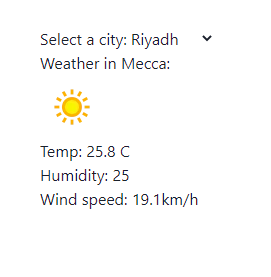

بستعمال المفاهيم السابقة , وباستخدام https://www.weatherapi.co :
-قم بالتسجيل بالموقع و الحصول على Api key . 
- بستعمال select ادخل خمس مدن.
- يجب ان تكون تجربة المستخدم كامله . 
- من بيانات ال API قم بعرض خمس مدن بحيث يقوم بعرض : درجة الحرارة و سرعة الرياح و الرطوبة و icon الطقس.
 

